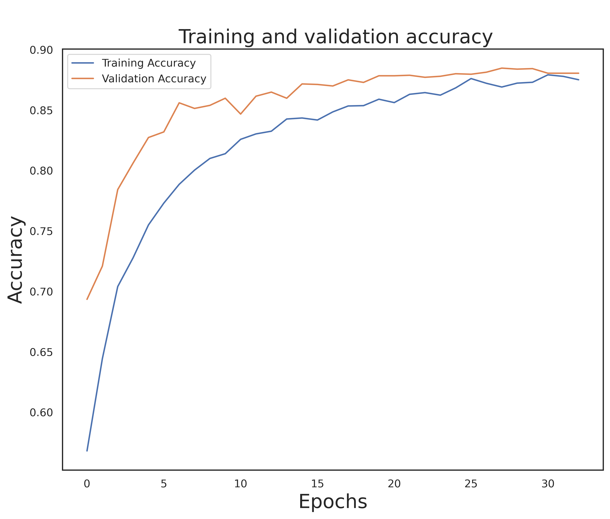
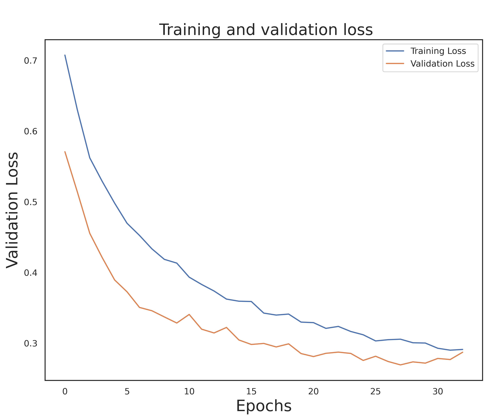

# Melanoma Detection using CNN VGG16

## Overview
This repository contains the code implementation for melanoma detection using Convolutional Neural Network (CNN) with VGG16 architecture. The model is trained on a dataset of skin lesion images to classify melanoma and non-melanoma lesions.

## Features
- Utilizes pre-trained VGG16 model for feature extraction
- Fine-tuned for melanoma detection
- Provides scripts for training, evaluation, and prediction

## Dataset
### Data Details
- **Source:** Kaggle
- **Size:** 10,604 images
- **Availability:** The dataset comprises images with dimensions of 300x300 pixels.
- **Preprocessing:** 
  - Resized from 300x300 pixels to 224x224 pixels.
  - Aspect ratio maintained during resizing.
  - Interpolation methods applied to preserve image quality.

### Dataset Balance
The dataset is balanced with a ratio of 1.07, ensuring that there is no significant class imbalance that could bias the model's training.


## Software Requirements

### Programming Language
- Python 3.10

### Packages
- NumPy
- Pandas
- Tensorflow
- Sklearn
- Matplotlib
- Torch
- Seaborn

### Metrics
- Accuracy
- Precision
- Recall
- F1-score

### Tool
- Jupyter Notebook

These software requirements are essential for developing, training, and evaluating machine learning models for melanoma detection using the provided dataset. Ensure that you have the specified versions of Python and the required packages installed in your development environment to run the code seamlessly.

## Usage
Clone the repository:
   ```
   git clone https://github.com/20WH1A05B0/Major_Project_Melanoma_Detection.git
   ```

## Results

| Metric | VGG16 | ResNet50 | VGG11 |
|---|---|---|---|
| Accuracy | 88.60% | 90.15% | 87.82% |
| Precision | 89.00% | 91.23% | 86.54% |
| Recall | 88.13% | 89.71% | 88.47% |
| F1-score | 88.26 | 90.47% | 87.50% |






[Provide any notable results or performance metrics achieved by the model.]

## References
[Include any relevant papers, articles, or resources that inspired or guided your work.]

## Contributing
[Provide guidelines for contributing to the project, if applicable.]

## Authors
- [Your Name](https://github.com/yourusername)

## Acknowledgements
[Thank any individuals, organizations, or projects that contributed to your work.]
